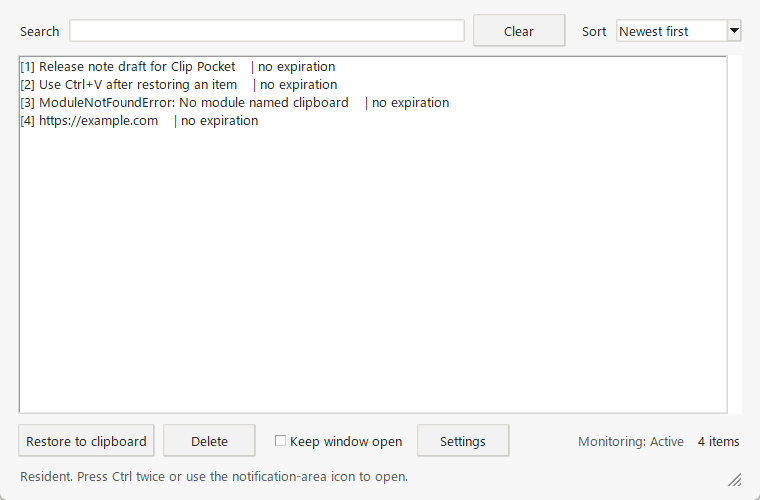

# Clip Pocket

[](https://github.com/sekihan02/Clip_Pocket/actions/workflows/ci.yml)
[](https://github.com/sekihan02/Clip_Pocket/releases)
[](LICENSE)


[](docs/README.ja.md)

Clip Pocket is a resident Windows app for keeping copied text temporarily and choosing it again when you want to paste it later.

Current source version: v0.2.1

[日本語 README](docs/README.ja.md)

---

Clip Pocket watches text copied to the Windows clipboard and keeps a short in-memory list. When you want to paste something you copied earlier, open Clip Pocket, double-click that item to make it the current clipboard text, then paste with `Ctrl+V`.

## Screenshot



The screenshot shows the default white color setting. Color, opacity, and window size can be changed from `Settings`.

## Getting Started

Download the Windows build from the GitHub release, unzip it, and run:

```powershell
ClipPocket.exe
```

The app starts hidden in the notification area. Open the window with:

- Double-tap `Ctrl`
- Click or double-click the notification-area icon
- Run `ClipPocket.exe` again while Clip Pocket is already running

The experimental right-click triple-click gesture is disabled by default. Enable it from the notification-area icon's settings menu if you want to try it.

## Features

- Resident clipboard monitoring for copied text
- One-character text is recorded; empty text is ignored
- In-memory history, cleared when the app exits
- Restore a selected item to the current clipboard
- Manual paste only; Clip Pocket does not inject keystrokes or paste automatically
- Duplicate copies are refreshed instead of added again
- Delete unwanted items with `Delete`, the delete button, or the item context menu
- Auto-hide window behavior, with an option to keep the window open
- Settings from the notification-area icon or the main window
- Temporary pause/resume from the notification-area icon
- English UI by default, with Japanese available in settings
- Configurable retention period, including unlimited retention while the app is running
- Configurable maximum item count
- White or black window color
- Configurable window opacity
- Configurable window size, either by dragging the window edge or from Settings

## Install

For normal use, download the prebuilt Windows ZIP from the latest release.

The one-folder build contains `ClipPocket.exe` and its runtime files. Keep the folder together when moving it.

## Settings

Right-click the notification-area icon and choose `Settings`. You can also open the main window and choose `Settings`.

Settings are applied together when you choose `Apply`. Closing the settings window without applying leaves the current settings unchanged.

Available settings:

- Start when Windows starts
- Open with Ctrl double-tap
- Open with right-click triple-click (experimental, off by default)
- Language
- Color
- Opacity (0-100%; 0% is still kept faintly visible so the window cannot disappear completely)
- Window width
- Window height
- Delete copied items after
- Maximum copied items

The notification-area menu also includes `Pause monitoring` / `Resume monitoring`. Paused clipboard changes are ignored and are not added later when monitoring resumes.

## Window Behavior

Clip Pocket opens near the pointer and keeps the window inside the screen. If the window has to shift away from the pointer at a screen edge, it stays visible until you move the pointer. After the pointer moves outside the window, the window hides quickly unless `Keep window open` is enabled.

## Security and Privacy

- Copied text is stored in memory only.
- Clipboard contents are not written to disk.
- App settings and diagnostic logs are written under `%LOCALAPPDATA%\ClipPocket`.
- No network access is used by the app.
- The app does not automatically paste into other applications.
- Very large copied text is ignored, and the in-memory history has a total text-size limit.
- The Ctrl double-tap shortcut uses a low-level keyboard hook.
- The right-click triple-click gesture uses a low-level mouse hook only when enabled.

## Known Limitations

- Text clipboard contents only.
- Images, files, and rich text formatting are not saved.
- History is cleared when the app exits.
- Clip Pocket only records clipboard changes while it is running. Text that was already on the clipboard before startup is not added automatically.
- The app does not paste automatically.
- Global shortcuts may not work in some elevated apps, remote desktops, games, or security-sensitive windows.
- The right-click triple-click gesture is experimental and may conflict with normal context menus.

## Troubleshooting

### The app starts but no window appears

Clip Pocket starts hidden in the notification area. Click the notification-area icon, double-tap `Ctrl`, or run `ClipPocket.exe` again.

### Ctrl double-tap does not open the window

Open `Settings` and make sure `Open with Ctrl double-tap` is enabled. Some apps may block or override global keyboard hooks.

### Windows shows a warning

Unsigned executables may trigger Windows SmartScreen. Only run builds downloaded from the official release page, or build from source yourself.

## Uninstall

Clip Pocket does not install files outside the folder you extracted, but it may save local settings and diagnostic logs.

1. Quit Clip Pocket from the notification-area menu.
2. If startup is enabled, open `Settings` and turn off `Start when Windows starts`.
3. Delete the extracted `ClipPocket` folder.
4. To remove local settings and logs, delete:

```text
%LOCALAPPDATA%\ClipPocket
```

Clipboard history itself is kept in memory only and is cleared when the app exits.

## Build from Source

The project uses Python and uv.

Prerequisites:

- Windows
- Python 3.11+
- uv on PATH

Setup:

```powershell
git clone https://github.com/sekihan02/Clip_Pocket.git
cd Clip_Pocket
uv sync
uv run clip-pocket
```

Build the Python package:

```powershell
uv build --out-dir dist\python
```

Build the Windows executable:

```powershell
uv sync --extra build
uv run --extra build python tools/build_exe.py --clean
```

Output:

```text
dist\windows\ClipPocket\ClipPocket.exe
```

## Quality Checks

```powershell
$env:PYTHONPATH = "src"
python -m unittest discover -s tests
python -m py_compile src\clip_pocket\*.py tools\build_exe.py
```

The history and settings logic can also be tested on non-Windows systems by setting `PYTHONPATH=src`.

## Architecture

```text
src/clip_pocket/
├── app.py          # CLI entry point and single-instance startup
├── history.py      # Clipboard history rules
├── i18n.py         # English/Japanese UI strings
├── resources.py    # Asset lookup for source and bundled builds
├── settings.py     # Local JSON settings
├── startup.py      # Per-user Windows startup registration
├── ui.py           # Tkinter UI
└── win32_host.py   # Hidden Win32 window, clipboard listener, tray icon, hooks
```

Clip Pocket keeps the Tkinter UI and Win32 integration separate. Windows messages are received by a hidden Win32 window and forwarded to the UI thread through a queue.

The project name should not be treated as legal or trademark clearance. Please do your own review before redistributing under a different name or brand.

## License

MIT
